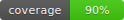

[English](README.md) | [Nederlands](README.nl.md)

# NLO



A Vue 3 + Vite project implementing a 100x100 surprise calendar with a mocked backend, deterministic seeding, IndexedDB persistence, and MSW-driven API.

## Tech stack

- Vue 3 + Vite 7 + TypeScript
- Pinia (state), Vue Test Utils + Vitest (tests)
- MSW 2 (API mocking) for dev/tests
- IndexedDB via `idb` for persistence

## Project Setup

```sh
pnpm install
```

### Compile and Hot-Reload for Development

```sh
pnpm dev
```

### Type-Check, Compile and Minify for Production

```sh
pnpm build
```

### Run Unit Tests with [Vitest](https://vitest.dev/)

```sh
pnpm test
```

Run once (no watch):

```sh
pnpm test:run
```

### Lint with [ESLint](https://eslint.org/)

```sh
pnpm lint
```

## Scripts

- **dev**: `pnpm dev` — start Vite dev server.
- **build**: `pnpm build` — type-check then build for production.
- **preview**: `pnpm preview` — preview built app.
- **test (watch)**: `pnpm test` — run Vitest in watch mode.
- **test (once)**: `pnpm test:run` — run tests once.
- **coverage**: `pnpm test:coverage` — run tests with coverage (used by CI badge).
- **lint**: `pnpm lint` — lint and auto-fix.
- **format**: `pnpm format` — format source files under `src/`.

---

## Features

- **Grid** 100x100 (10,000 cells) rendered in `src/frontend/features/game/components/GameSection.vue`.
- **Interaction** One reveal per user with a short prize animation.
- **Persistence** Opened cells and prizes persist via IndexedDB.
- **Simulated multi-user** A bot periodically reveals cells to emulate other users.

## Typography (Global)

This project uses a minimal, NLO-inspired typography system with performance in mind.

- Families
  - UI/body: Nunito Sans (weights 400, 600, 700)
  - Display: Fredoka (weight 700)
- Loading
  - Imported via Google Fonts in `index.html` with `display=swap` and `preconnect`.
  - Only required weights are loaded; subset defaults to latin.
- Tokens and Scale
  - Defined in `src/frontend/styles/theme.css`:
    - Families: `--font-family-ui`, `--font-family-display`
    - Weights: `--font-weight-regular|semibold|bold`
    - Fluid sizes: `--fs-h1..--fs-h6`, `--fs-body`, `--fs-small`, `--fs-overline`, `--fs-button`
  - Applied globally in `src/frontend/styles/global.css`:
    - Default font-family set to UI family.
    - `h1–h3` mapped to Display family bold; `h4–h6` use UI semibold.
    - Controls (buttons, inputs, selects, textareas) inherit fonts and use `--fs-button`.
    - Numeric utilities: `.num-tabular` (tabular lining) and `.num-proportional`.
- Utilities are defined in `src/frontend/styles/utilities.css` and use the same tokens.

Adjusting the scale or families
- Edit tokens in `theme.css`. All components derive from these tokens; avoid component-scoped font overrides.

Performance & a11y
- Minimal weights; `swap` to reduce CLS; strong fallbacks in stacks.
- Verify Lighthouse/PSI (CLS should remain stable). If needed, preload a single critical weight.


## Styling guide

Use the shared design tokens and primitives before adding new component CSS. Keep raw values out of components; prefer tokens from `src/frontend/styles/theme.css` and responsive tokens from `src/frontend/styles/breakpoints.css`.

* __Tokens (`theme.css`)__
  - Colors, surfaces, borders, states, typography, radii, shadows, focus.
  - Component aliases: buttons, admin bar, modal/overlay, links, play states.
  - Dark mode overrides via `.theme-dark` (only variable overrides, no selectors).
  - Do: `color: var(--text)`; Don't: `color: #111`.

* __Responsive tokens (`breakpoints.css`)__
  - Defines canonical breakpoints and semantic layout vars, e.g. `--header-topbar-direction`, `--prize-strip-gap`, `--footer-grid-cols`, `--topbar-height`.
  - Components should consume these variables; avoid repeating media queries in components.

* __Style entry (`index.css`)__
  - Import order: theme → breakpoints → layout → utilities → global.
  - Element typography (`h1–h6`) and form controls mapping.
  - App chrome uses `#app { padding-top: var(--topbar-height); }`.

* __Primitives & utilities__
  - `utilities.css`: utility classes for spacing, display, grid, typography helpers.
  - `layout.css`: canonical container `.container` using `--container-max` and `--container-gutter`.
  - Prefer `.container`.

* __Conventions__
  - Prefer tokens and helpers before writing new CSS.
  - If you need a new reusable pattern (e.g., a grid helper), add it to `utilities.css`.
  - If you need app-wide layout spacing, consider a token in `breakpoints.css`.
  - Keep scoped component CSS minimal and token-driven.

Examples

```vue
<template>
  <section class="container">
    <h2 class="overline overline--muted">Section</h2>
    <div>…</div>
  </section>
</template>
```

## Quick start

1. Install deps

```sh
pnpm install
```

2. Ensure MSW worker exists (already added to `public/` but command here for reference):

```sh
pnpm dlx msw init public --save
```

3. Run dev server

```sh
pnpm dev
```

4. Verify MSW
- **[Expected]** Network shows `GET /mockServiceWorker.js` 200 (content-type JavaScript).
- **[Code path]** `src/main.ts` dynamically imports `src/backend/msw/browser.ts` in dev and starts the worker.

### MSW in production (demo)
This project intentionally enables MSW in production builds for demo purposes.
- Source: `.env.production` sets `VITE_ENABLE_MSW=true` so `src/main.ts` starts the worker in prod, too.
- Implication: All API calls are served by the in-browser mock worker; there is no real backend.
- Changing later: Set `VITE_ENABLE_MSW=false` (or remove the key) for real deployments and wire a live API.

## Architecture

Directories of interest:

- **`src/backend/`**
  - `api.handlers.ts` — HTTP endpoints (boot, snapshot, reveal, bot step, admin reset). Single source of truth for API routes.
  - `domain/` — Domain models and logic
    - `grid/` — `schema.ts` (types, helpers), `seed.ts` (grid seed + bot reveal order)
    - `users/` — `model.ts` (User), `generator.ts` (deterministic user generation)
    - `shared/` — `rng.ts` (deterministic PRNG utilities)
  - `infra/` — Infrastructure
    - `idb.ts` — IndexedDB config and open helper
    - `state.ts` — In-memory state singletons and accessors
    - `meta.ts` — App meta and counters persistence helpers
    - `util.ts` — Small infra utilities
  - `services/` — Application services orchestrating domain + infra
  - `index.ts` — Backend barrel exports used by handlers
  - `msw/browser.ts` — MSW worker setup for the browser (dev only)
  - `msw/server.ts` — MSW server setup for tests (Node/Vitest)

- **`src/frontend/`**
  - `App.vue` — App shell.
  - `features/game/`
    - `api.ts` — Client for game endpoints.
    - `components/` — `CalendarGrid.vue`, `GameSection.vue`, `GameMetrics.vue`, `GridTooltip.vue`, `InitScreen.vue`, `RevealModal.vue`.
    - `composables/` — `useInitApp.ts`, `useGridCells.ts`, `useGridHoverTooltip.ts`, `useGridTooltip.ts`.
    - `store/` — `grid.ts`, `bot.ts`, `session.ts`, `status.ts`.
  - `features/admin/`
    - `api.ts` — Client for admin endpoints.
    - `components/` — `AdminBar.vue`.
    - `store/` — `adminUI.ts`, `exposed.ts`; `useAdminControls.ts`.
  - `features/chrome/`
    - `components/` — `TopBar.vue`, `Header.vue`, `Footer.vue`.
  - `ui/` — Reusable UI: `Button.vue`, `Modal.vue`, `Tooltip.vue`, `Slider.vue`.
  - `lib/` — Helpers: `http.ts`, `clientId.ts`, `format.ts`, `botSpeed.ts`.
  - `styles/` — Global styles: `global.css`, `theme.css`.
  - `types/` — Shared types: `api.ts`.

- **`public/`**
  - `mockServiceWorker.js` — MSW worker script (served by Vite at `/mockServiceWorker.js`).

Other entry points:

- **`src/main.ts`** — Starts MSW in dev, mounts Vue app and Pinia.
- **`src/setupTests.ts`** — Starts MSW server for unit tests.

## API surface

All endpoints are defined once in `src/backend/api.handlers.ts` and mounted by MSW.

Core:

- `POST /api/boot` — Initialize state with optional `seed`.
- `GET /api/snapshot` — Current snapshot: meta, revealed cells, counts.
- `POST /api/reveal` — Reveal a cell: `{ id, playerId? }`.
- `POST /api/bot/step` — Deterministic bot reveal step.

Admin:

- `POST /api/admin/reset` — Reset state; optional `{ seed }`.
- `POST /api/admin/bot-delay` — Set bot delay range `{ minMs, maxMs }`.
- `GET /api/admin/bot-delay` — Get current bot delay range.
- `GET /api/admin/targets` — Reveal hidden target cells (grand + consolation) for admin.
- `POST /api/admin/pick-random-player` — Pick a random eligible user.
- `GET /api/admin/current-player` — Get current selected player.
- `POST /api/admin/current-player` — Set current player `{ playerId|null }`.

Users:

- `POST /api/users/assign` — Assign or retrieve a user for a client; sets `nlo-client-id` cookie when missing.
- `POST /api/users/resolve` — Resolve user details by ids `{ ids: string[] }`.

### Users — assignment semantics
- `assignUserForClient(clientId)` provides a deterministic mapping of a client id to a user. It does not filter by eligibility (`played === false`).
- Eligibility for actually playing is enforced elsewhere (e.g., admin selection via `pickRandomEligibleUser()` / `setCurrentPlayer()` and the reveal flow).
- Rationale: Assignment is used primarily to label a session consistently; game logic guards actual play.
- If you ever need assignment to return only eligible users, filter to `!played` before choosing.

Client functions live under `src/frontend/features/game/api.ts` and `src/frontend/features/admin/api.ts`, mapping 1:1 to these endpoints.

## Tests

Run unit tests:

```sh
pnpm test
```

MSW server auto-starts in `src/setupTests.ts`.

### Coverage

Generate a full-project coverage report (used by CI for the README badge):

```sh
pnpm test:coverage
```

CI (GitHub Actions: `tests-and-coverage.yml`) parses `coverage/coverage-summary.json`, generates `public/coverage.svg`, and commits it on `main`/`master`. The badge at the top of this README reflects the latest default-branch run.
